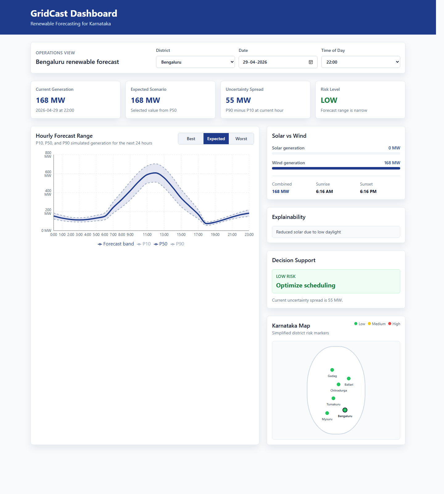
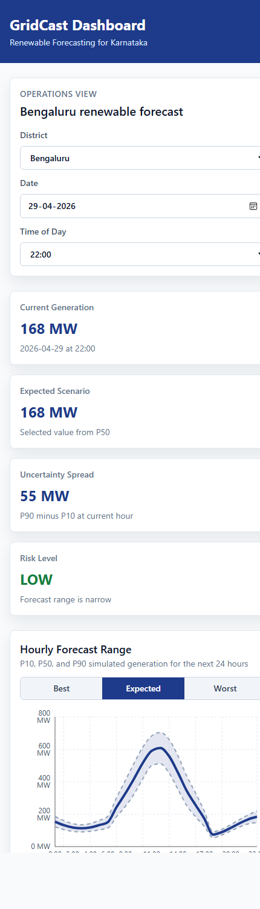

# GridCast Dashboard

GridCast is a frontend-only renewable generation forecasting dashboard for Karnataka. It simulates solar and wind generation forecasts, uncertainty ranges, explainability signals, and operator decision support for selected districts.

Live demo: [https://rupangkan25.github.io/GridCast](https://rupangkan25.github.io/GridCast)

## Snapshots

### Desktop Dashboard



### Mobile Layout



## Features

- District selector for Bengaluru, Mysuru, Tumakuru, Chitradurga, Gadag, and Ballari
- Date and time controls for viewing forecasts by hour
- Simulated 24-hour renewable generation forecast
- P10, P50, and P90 uncertainty bands
- Scenario toggle for Best, Expected, and Worst forecast views
- Risk indicator based on forecast uncertainty spread
- Explainability panel for cloud, wind, and daylight effects
- Decision support recommendations for grid operators
- Solar, wind, and combined generation breakdown
- Sunrise and sunset estimates
- Simplified Karnataka map with district risk markers

## Tech Stack

- React
- Vite
- Tailwind CSS
- Recharts
- Plain JavaScript
- GitHub Pages deployment with `gh-pages`

## Forecast Simulation

The dashboard does not use a backend, Python, APIs, or external data services. All values are simulated in the frontend using deterministic district and date inputs.

The simulation includes:

- Solar generation based on daylight and cloud cover
- Wind generation based on wind speed
- Combined generation
- P10, P50, and P90 forecast values
- Risk level derived from `P90 - P10`

## Run Locally

Install dependencies:

```bash
npm install
```

Start the development server:

```bash
npm run dev
```

Open the local URL shown by Vite. For this project, the app is configured for:

```text
http://127.0.0.1:5173/GridCast/
```

## Build

```bash
npm run build
```

Preview the production build:

```bash
npm run preview
```

## Deploy

The project is configured for GitHub Pages.

```bash
npm run deploy
```

This builds the app and publishes the `dist` folder to the `gh-pages` branch.

## Project Structure

```text
GridCast/
├── docs/
│   └── screenshots/
├── src/
│   ├── components/
│   ├── App.jsx
│   ├── index.css
│   └── main.jsx
├── index.html
├── package.json
├── tailwind.config.js
└── vite.config.js
```

## GitHub Pages Configuration

The deployment path is configured for the repository name:

```js
base: "/GridCast/"
```

The package homepage is:

```json
"homepage": "https://rupangkan25.github.io/GridCast"
```
